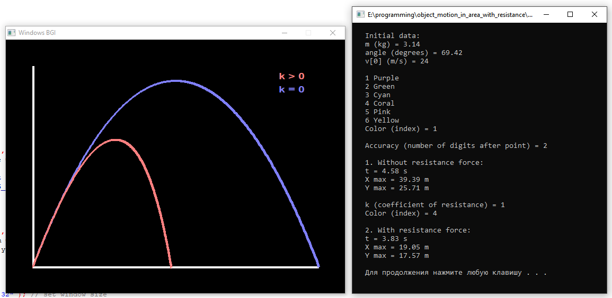

# Modeling of motion of object thrown at an angle to the horizon in area with resistance force and without it.

Features
---
- Comparing curves of motions
- Computing max range, max height and time of motions
- User can set accuracy of results (number of digits after point) from 0 to 7
- User can choose color of graphs from 6 submitted
- Checking for valid input of initial data
- Auto optimizing of calculation accuracy to provide high speed of program execution
- Auto resizing graph to fit window size

